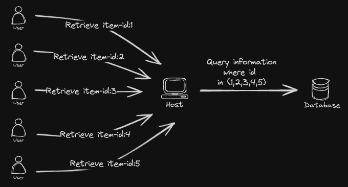

# Go-Dataloader

A generic Go implementation of the [DataLoader](https://github.com/graphql/dataloader) utility originally developed by Facebook.

## Overview

This dataloader implementation efficiently loads data in batches, reducing the number of requests to your database or service. It supports:

- Generic types for keys and values
- Batching of requests
- Caching results
- Customizable options
- Built-in tracing for observability

### How does dataloader work

DataLoader operates by grouping multiple requests within a short time window into a single request to resolve the N+1 problem.

## Cache

The default cache is not functional. You can implement your own cache, but it must be thread-safe, like [golang-lru](https://github.com/hashicorp/golang-lru), otherwise, it will panic.
